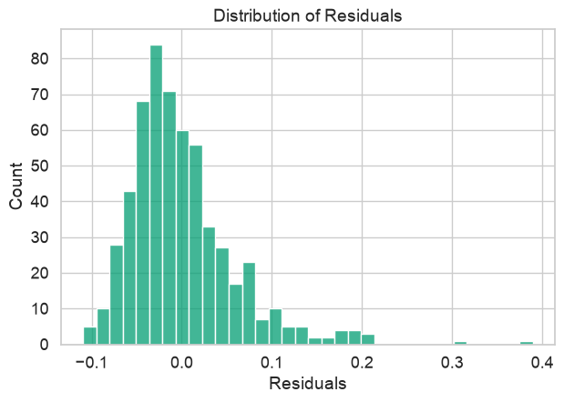

The dataset has 569 biopsies, each described by measurements of the cell nuclei and labelled malignant (212) or benign (357).

## Do malignant tumors differ in cell symmetry?

I compared mean cell symmetry between the two groups with a two-sample t-test, a 95% confidence interval, and Cohen's d. The descriptive statistics (mean, median, mode, standard deviation, range) are written from scratch instead of taken from a library.

| Result | Value |
| :--- | :--- |
| Mean symmetry, malignant vs benign | 0.1929 vs 0.1742 |
| t statistic | 8.34 (p = 5.7 × 10⁻¹⁶) |
| 95% confidence interval for the difference | [0.0142, 0.0233] |
| Cohen's d | 0.72 (medium) |

Malignant tumors have a higher mean symmetry value. The difference is statistically significant with a medium effect size.

## How well does tumor radius predict concavity?

I fitted a simple linear regression of mean concavity on mean radius, then checked the model's assumptions with a residuals-vs-fitted plot, a residual histogram, and a normal Q–Q plot.

| Result | Value |
| :--- | :--- |
| Pearson's r | 0.677 |
| R² | 0.458 |
| Regression line | concavity = 0.0153 × radius − 0.1275 |
| Slope, 95% confidence interval | [0.014, 0.017] (p = 1.9 × 10⁻⁷⁷) |

Radius explains about 46% of the variation in concavity. The slope is clearly non-zero, but the residuals are right-skewed: concavity cannot go below zero, which puts a hard lower edge on the residuals while a few tumors sit far above the line. The normality assumption does not fully hold, and I say so in the write-up.

## Background

The notebooks started from a course template, and the regression plotting helper follows the template's structure. The analysis, statistics functions, and interpretation are my own.
