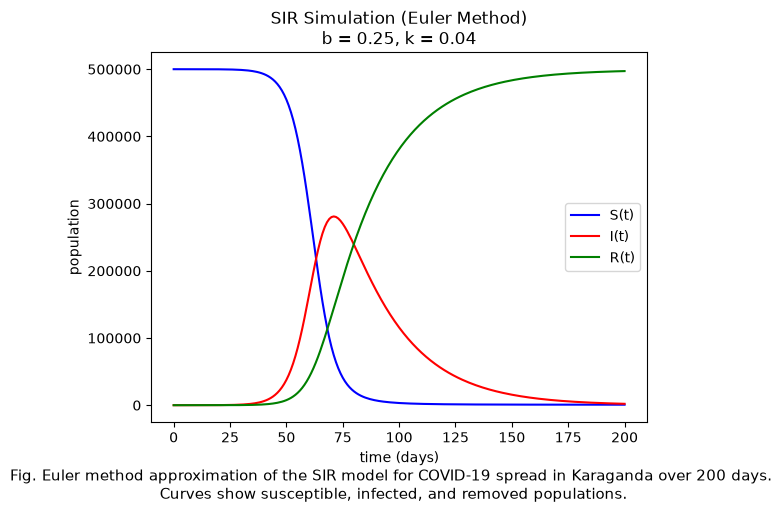

## The model

The population is split into three groups: susceptible `S`, infected `I`, and removed `R`.

```
dS/dt = -b·S·I / N
dI/dt =  b·S·I / N - k·I
dR/dt =  k·I
```

`b` is the infection rate and `k` the removal rate. The equations have no closed-form solution, so the solver steps them forward one day at a time: next value = current value + step × derivative.

## Parameters

| Parameter | Value | Source |
| :--- | :--- | :--- |
| Population | 500,000 susceptible, 3 infected | Approximate size of Karaganda |
| Infection rate `b` | 0.17 | Mean transmission rate for Karaganda in Koichubekov et al. (2023) |
| Removal rate `k` | 0.04 | Baseline choice |
| Step size | 1 day | |

The reported standard deviation of `b` is 0.075, so I also ran `b = 0.10` and `b = 0.25` to cover roughly one standard deviation either side, and `k = 0.02` and `k = 0.06` to see the effect of slower and faster removal. That gives five scenarios in total.

## What it shows

A higher infection rate gives an earlier and taller peak of infections. A higher removal rate lowers and flattens the peak, and leaves more of the population never infected.

The baseline run:


The higher infection rate, `b = 0.25`:



## Assumptions and limits

- Everyone mixes with everyone equally. There are no households, ages, or districts.
- `b` and `k` stay constant, so lockdowns, vaccination, and behaviour change are not modelled.
- The population is fixed: no births, deaths from other causes, or travel.
- Euler's method with a one-day step is a first-order approximation. A smaller step or a higher-order method would track the true solution more closely.

## Reference

Koichubekov, B., Takuadina, A., Korshukov, I., Turmukhambetova, A., & Sorokina, M. (2023). Is it possible to predict COVID-19? Stochastic system dynamic model of infection spread in Kazakhstan. *Healthcare, 11*(5), 752.
